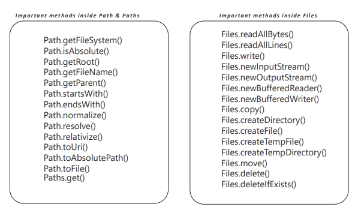

# Enhancements Related to Files and Directories

Java 7 introduced significant improvements for file handling by updating the NIO (New I/O) package, originally added in Java 1.4. These enhancements simplify common tasks such as reading, copying, deleting, and navigating files and directories.

**New NIO File APIs (Java 7)**

The following classes were added under `java.nio.file.*`:
- `java.nio.file.Path`
- `java.nio.file.Paths`
- `java.nio.file.Files`

These APIs address many limitations of the older `java.io.File` class.

--- 

### Stream vs Buffer

**Stream**
- Data is read sequentially (forward-only).
- Cannot easily move forward/backward.
- Similar to watching a live Netflix stream: skipping 30 minutes ahead takes time because the system must buffer data.

**Buffer**
- Data is preloaded/stored in memory, allowing fast repeated access.
- Supports moving backward and forward with low latency.
- Similar to skipping 10 seconds forward/backward on a pre-buffered video.

---

### `Path` and `Paths`

**`java.nio.file.Path`**

- New interface introduced in Java 7 to replace `java.io.File`.
- Represents a sequence of directory names, optionally ending in a file name.
- Core component for all file-system path operations.

**`java.nio.file.Paths`**

- Utility class with static methods to create `Path` instances.
- Has two static methods for creating a Path from a `path string` & `URI`
- Automatically handles platform-specific file separators (`/` on Unix, `\` on Windows).

**Example**

```java
Path path = Paths.get("C:", "Users", "Documents", "notes.txt");
```

This automatically handles system-specific separators.

---

**Methods that got introduced in JAVA Path and Paths** 


---