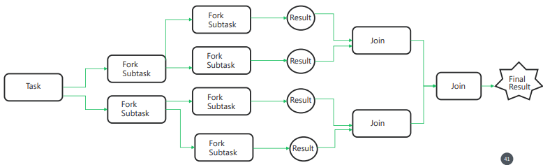

# Fork and Join Framework

With advancements in multicore processors and GPUs, the Java community needed a framework that could efficiently leverage **all available CPU cores** for parallel processing.

To address this, Java 7 introduced the **Fork & Join Framework**, which supports parallel computing by **splitting (forking)** a large task into many small subtasks, processing them in parallel, and then **joining** their partial results to form the final output.

> Sample pseudo code of Fork & Join framework:
>
> 

### How It Works (Divide and Conquer)

The Fork/Join framework applies the _divide and conquer_ principle:
1. **Fork**

   A large task is recursively divided into smaller subtasks until a defined threshold is reached.
2. **Compute independently**

   Subtasks are executed in parallel by worker threads inside a **ForkJoinPool**.
3. **Join**

   Once subtasks finish, their results are combined recursively to produce the final answer.

This follows the same conceptual model shown in the diagrams:



---

### Important Components
#### ForkJoinPool

The heart of the framework. It manages worker threads and uses a _work-stealing algorithm_ to balance the workload:

- Each worker has its own deque.
- If a worker finishes its tasks, it **steals** tasks from the bottom of another worker’s deque.
- This avoids thread starvation and maximizes CPU usage.

This same mechanism underlies **Java 8 parallel streams.**

#### ForkJoinTask

Base class for tasks run inside the ForkJoinPool.

Two common subclasses:

|Class |	Returns a Value? | 	Use Case                |
|----------| -------|--------------------------|
|RecursiveAction | No return value| 	Tasks that modify state |
| RecursiveTask<V> |Returns value |	Tasks that compute a result|

Both must implement the `compute()` method, where the task’s logic lives.

---

### RecursiveAction vs RecursiveTask
- Both extend `ForkJoinTask`
- Both implement `compute()`
- **RecursiveAction** → _no return value_
- **RecursiveTask<V>** → _returns a value_

In the provided example, `RecursiveAction` is used, so the computed result is stored in a field instead of being returned.

---

## Code Example: Computing Fibonacci in Parallel (ForkJoinExample)

Below is the example using `RecursiveAction`:

### compute() method
```java
private static final long threshold = 2;

protected void compute() {
    long n = number;
    if (n <= threshold) {
        number = fib(n);
    } else {
        ForkJoinExample f1 = new ForkJoinExample(n - 1);
        ForkJoinExample f2 = new ForkJoinExample(n - 2);
        ForkJoinExample.invokeAll(f1, f2);
        number = f1.number + f2.number;
    }
}
```

1. Threshold Check

```java
if (n <= threshold) {
  number = fib(n);
}
```
- If `n <= 2`, the computation is simple enough to do **sequentially**.
- No further recursive tasks are created.
- `fib(n)` is computed using a normal recursive function.

2. Forking Subtasks

```java
ForkJoinExample f1 = new ForkJoinExample(n - 1);
ForkJoinExample f2 = new ForkJoinExample(n - 2);
ForkJoinExample.invokeAll(f1, f2);
```
- When `n > threshold`, the task splits into:
  - Fibonacci(n - 1)
  - Fibonacci(n - 2)
- `invokeAll()` does two things:
  - **Forks** both tasks (submits them to the ForkJoinPool)
  - **Joins** them automatically (waits for results)

These subtasks may run **in parallel** on different cores.

3. Joining Results
```java
number = f1.number + f2.number;
```
- After both subtasks complete, the results are combined.
- The value for the current Fibonacci number is stored in `number`.

### fib() Method

```java
private static long fib(long n) {
   if (n <= 1)
      return n;
   else
      return fib(n - 1) + fib(n - 2);
}
```

- A simple recursive Fibonacci implementation.
- Only used when n ≤ threshold (base case).
- Prevents excessive task creation.

### Main Method

```java
public static void main(String[] args) {
   ForkJoinExample task = new ForkJoinExample(20);
   new ForkJoinPool().invoke(task);
   System.out.println(task.getNumber());
}
```

#### What it does:

- Creates a task to compute `fib(20)`
- Creates a ForkJoinPool (default: number of CPUs)
- Calls `.invoke(task)` which:
  - starts the compute() process
  - waits for the result
- Prints the computed Fibonacci number

---

### Execution Flow Summary

- `fib(20)` splits into `fib(19)` and `fib(18)`
- Each splits further until reaching the threshold `2`
- Base cases computed normally
- Results are combined upward
- The ForkJoinPool uses work-stealing to speed things up
- Final answer is printed

---
