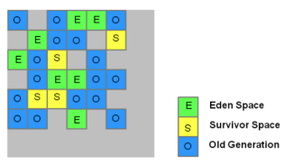

# Garbage First (G1) Collector

JDK 7 introduced a new Garbage Collector known as G1 Garbage Collection, which is
short form of garbage first. G1 is planned as the long term replacement for the existing
Concurrent Mark-Sweep Collector (CMS). Comparing G1 with CMS, there are differences
that make G1 a better solution.
• The older garbage collectors (serial, parallel, CMS) all structure the heap into three
sections: young generation, old generation, and permanent generation of a fixed memory
size. All memory objects end up in one of these three sections.

The G1 collector takes a different approach. The heap is partitioned into a set of equalsized heap regions, each a contiguous range of virtual memory. Certain region sets are
assigned the same roles (eden, survivor, old) as in the older collectors, but there is not a
fixed size for them. This provides greater flexibility in memory usage.

Compared to most other garbage collectors, the G1 has two big advantages:
✓ It can do most of its work concurrently (i.e., without halting application threads), and
✓ Splitting the heap into small regions enables the G1 to select a small group of regions
to collect and finish quickly.
✓ One of the good property of this is you can configure this for maximum pause time
using flag (-XX:MaxGCPauseMillis=n)
• G1 will be more suitable for users running applications that require large heaps with
limited GC latency. This means heap sizes of around 6GB or larger, and stable and
predictable pause time below 0.5 seconds.
• From Java 9, the Garbage First (G1) GC as its default garbage collector

