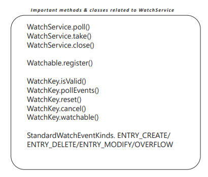

# WatchService

Java 7 introduces a new interface called ‘java.nio.file.WatchService’ that watches registered
objects for changes and events. For example a file manager may use a watch service to
monitor a directory for changes so that it can update its display of the list of files when files
are created or deleted.
• It is very common for many application to track on files such as configuration so that we can
refresh the value inside the memory on every change. We used to handle using a Thread that
periodically poll for file change before Java 7. But this made easy using ‘WatchService’.
• A Watchable object is registered with a watch service by invoking its register method,
returning a WatchKey to represent the registration. When an event for an object is detected
the key is signaled, and if not currently signaled, it is queued to the watch service so that it can
be retrieved by consumers that invoke the poll or take methods to retrieve keys and process
events. Once the events have been processed the consumer invokes the key's reset method to
reset the key which allows the key to be signaled and re-queued with further events.

Important methods and classes related to WatchService

