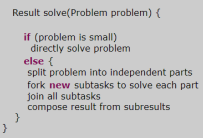

# Fork and Join Framework

With advancements happening in multicore processors and GPUs, there is a popular
demand from Java community for parallel computing framework that can leverage all the
processor available efficiently.
• To address that Java 7 introduces new Fork & Join framework that supports parallel
processing by splitting (forking) big tasks into a multiple small subtasks that can be
processed independently by using all the available CPU cores and eventually joining the
results from all the subtasks to get the final results.
• Sample pseudo code of Fork & Join framework,

Applying a divide and conquer principle, the framework recursively divides the task into
smaller subtasks until a given threshold is reached. This is the fork part.
• Then, the subtasks are processed independently and if they return a result, all the results
are recursively combined into a single result. This is the join part.

Important interfaces and classes inside the Fork & Join framework,
✓ java.util.concurrent.ForkJoinPool - The ForkJoinPool is the heart of the framework. It is an
implementation of the ExecutorService that manages worker threads and provides us with
tools to get information about the thread pool state and performance.
✓ java.util.concurrent.ForkJoinTask - ForkJoinTask is the base type for tasks executed inside
ForkJoinPool. In practice, one of its two subclasses should be extended: the RecursiveAction
for void tasks and the RecursiveTask<V> for tasks that return a value. They both have an
abstract method compute() in which the task’s logic is defined.
• ForkJoin framework follows ‘Work Stealing Algorithm’ where free threads try to “steal” work from
deques of busy threads
• In fact, Java 8's parallel streams underline uses the ForkJoin framework.
