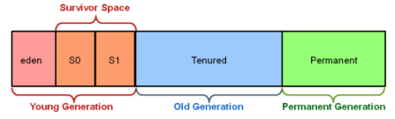

# Garbage First (G1) Garbage Collector

Java 7 introduced a powerful, modern garbage collector called the **G1 (Garbage First) Collector.**
It was designed as a long-term replacement for the **Concurrent Mark-Sweep (CMS)** collector.

- In Java 7 and Java 8 → G1 must be manually enabled
- In Java 9 and later → G1 is the default garbage collector

## Limitations of Older Collectors (Serial, Parallel, CMS)

Older garbage collectors divide the heap into **three fixed sections:**

**1. Young Generation**
   - Eden
   - Survivor space

**2. Old Generation**

**3. Permanent Generation**

**Object lifecycle in old collectors**
- A new object is allocated in **Eden**
- If it survives a few garbage collections → moved to Survivor
- If it survives enough cycles → promoted to Old Generation

>    Here's a visual representation of the Object lifecycle in old collectors.
>    

**Problems with older GCs**
- Large heaps become hard to manage
- Stop-the-world pauses occur to clean Survivor or Old Gen
- Larger heap = longer pause times
- Fixed memory sizing reduces flexibility

--- 

## What G1 Collector Changes

The **G1 GC** uses a completely different strategy.

🔹 **Heap is divided into many equal-sized regions**

Each region is a small chunk of memory (1–32 MB), and the entire heap is made of these regions.

🔹 **Regions take roles dynamically**

Some regions act as:
- Eden
- Survivor
- Old gen

…but **their sizes are NOT fixed.** G1 determines sizes automatically based on application needs providing flexibility.

>    Here's a visual representation of the Object lifecycle in G1 collectors
>    

### Advantages of G1 GC

Compared to most other garbage collectors, the G1 has big advantages:

1. **Mostly concurrent**
    
   G1 does most garbage collection work **without stopping application threads.**

2. **Region-based collection**

    Because the heap is split into many small regions, G1 can:
   - Select only a **few regions with the most garbage**
   - Clean them quickly
   - Reduce pause times

    This is why it's called **"Garbage First"**. It collects regions with the most garbage first.

3. Predictable pause times

   You can tune G1 to meet your application's latency needs:
    ```
    -XX:MaxGCPauseMillis=<N> //maximum pause time
   ```

    Example: 
    ```
    -XX:MaxGCPauseMillis=200
    ```
   This tells the JVM: Try to keep GC pauses below 200ms.

### When to Use G1 GC

G1 is ideal for:
- Large heap applications (6GB or more)
- Apps requiring **low-latency**, predictable GC pauses (< 0.5 seconds)
- Server-side applications
- High-throughput systems

---

