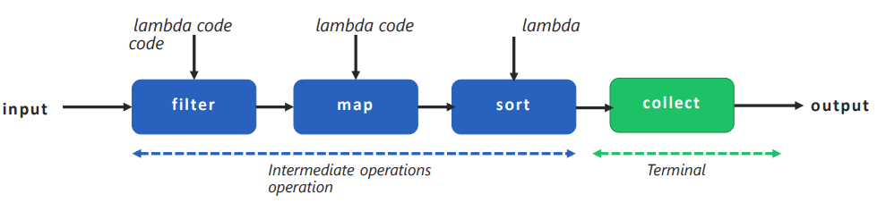

# Introduction to Streams

Java 8 introduced the `java.util.stream` API, designed for processing sequences of objects (typically items already stored in collections). The main class is `Stream<T>`.

> **Important distinction:**
> 
> `java.io streams` handle file/binary input and output, while
> `java.util.stream` streams operate on *in-memory object*s.

**Key Points**
- Collections like `List` or `Set` **store** data.
- Streams **do not store data**; they _represent_ a pipeline of operations performed on data.
- Streams allow **declarative programming** → describing _what_ you want to do (similar to queries), instead of explicitly writing loops to do it.
- Streams can be created from:
  - Collections
  - Arrays
  - `Stream.of()`
  - Iterators
  - Factory methods like `Stream.generate()` and `Stream.iterate()`

## Coding example: SimpleStream
### Printing from a list of Strings
```java
List<String> departmentList = new ArrayList<>();
departmentList.add("Supply");
departmentList.add("HR");
departmentList.add("Sales");
departmentList.add("Marketing");

Stream<String> depStream = departmentList.stream();
depStream.forEach(System.out::println);
```

**Explanation:**
- Creates a `List<String>` called `departmentList` and adds four department names into the list.
- `departmentList.stream()` 
  - Creates a sequential stream from the list.
- `forEach(System.out::println)`
  - Processes each element in the stream using a **method reference** (`System.out::println` is shorthand for `x -> System.out.println(x)`).

**Output:**
```java
Supply
HR
Sales
Marketing
```

### Creating a Stream from Elements

```java
Stream<String> inStream = Stream.of("Eazy", "Bytes", "Java");
inStream.forEach(System.out::println);
```

**Explanation:**
- `Stream.of(...)` creates a stream from the given elements.
- These string literals are stored in the **String Pool**, since they are compile-time constants.
- `forEach` prints each element.

**Output:**
```java
Eazy
Bytes
Java
```

### Parallel Stream
```java
Stream<String> parallelStream = departmentList.parallelStream();
parallelStream.forEach(System.out::println);
```
**Explanation:**
- `parallelStream()` creates a **parallel** version of the stream.
- Java splits the work across multiple CPU cores (Fork/Join framework).
- Output order is usually **not guaranteed** in parallel processing.

**Output:**
```java
Sales
Marketing
HR
Supply
```

### Empty Stream

```java
Stream<String> emptyStream = Stream.empty();
emptyStream.forEach(System.out::println);
```

**Explanation:**
- `Stream.empty()` creates a stream with **zero elements.**
- Calling `forEach` results in **no output**, because there is nothing to process.

---

## Streams Pipeline

A Stream in Java is processed through a _pipeline_ consisting of multiple stages. Each stage contributes to transforming, filtering, or producing results from the original data source.

A complete Stream pipeline contains three parts:
### 1. Creating a Stream (Source Stage)

A stream must first be created from a data source such as a collection, array, or direct factory method.

Common creation methods:

- `collection.stream()` — creates a sequential stream
- `collection.parallelStream()` — creates a parallel stream
- `Stream.of(...)` — creates a stream from given values

Arrays also gained new utility methods for stream creation:

```java
Arrays.stream(array);            // Stream from entire array
Arrays.stream(array, from, to);  // Stream from a specific range

```

### 2. Intermediate Operations (Transformation Stage)

These operations transform or filter the stream but **do not execute immediately.**
They are _lazy_ and return a **new stream**, forming the next stage in the pipeline.

Examples:
- `filter(...)`
- `map(...)`
- `distinct()`
- `sorted()`

A pipeline may contain **multiple** intermediate operations, chained together.

### 3. Terminal Operation (Execution Stage)

A terminal operation triggers the execution of the entire stream pipeline and produces a final result.

Examples:
- `forEach(...)`
- `collect(...)`
- `reduce(...)`
- `count()`

Once a terminal operation runs, the stream is **consumed** and cannot be reused!!

---

### Additional Stream Creation Utilities
#### Empty Stream

Create a stream with no elements:

```java
Stream<String> emptyStream = Stream.empty();
```

#### Infinite Streams

The Stream API provides methods for generating an **unbounded** (infinite) stream of elements, useful for sequences or continuously generated values.

Two important factory methods:

1. **Stream.generate(Supplier)**
    
   Creates an infinite stream where each element is produced by a Supplier.
   Ideal for random or repeated values. 

   Example:
    ```java
    Stream.generate(() -> new Random().nextInt());
    ```

2. **Stream.iterate(seed, unaryOperator)**

    Creates an infinite sequence starting with an initial value, where each next value is generated from the previous one.

    Example:
    ```java
    Stream.iterate(1, n -> n + 1);  // 1, 2, 3, 4, ...
    ```

---

## Map Method in Streams API

The `map()` method is one of the most commonly used intermediate operations in the Streams API. It is used whenever you want to **transform** each element of a stream into another form.

**Key Points:**
- `map()` is used to apply transformation logic to each element of a stream.
- It takes a `Function<T, R>` as input, meaning it converts a value of type `T` into a value of type `R`.
- In the example, each string in the list is transformed to **uppercase.**
- `map()` is an **intermediate** (lazy) operation and always returns a **new Stream.**
- Stream operations **do not modify the source**; they generate transformed results.
- The stream must end with a **terminal operation**. Here, `forEach()` prints each transformed value.

---

### Coding example: StreamOperations

```java
public static void mapInStreams() {
    List<String> departmentList = new ArrayList<>();
    departmentList.add("Supply");
    departmentList.add("HR");
    departmentList.add("Sales");
    departmentList.add("Marketing");

    departmentList.stream().map(word -> word.toUpperCase()).forEach(word->System.out.println(word));
}
```

**Explanation:**
- `stream()` creates a sequential stream from the list.
- `map(word -> word.toUpperCase())` applies the transformation to each element.
- `forEach(...)` is the **terminal operation** that consumes the stream and prints the values.
- To perform the same transformation **in parallel**, you can use `parallelStream()`.

**Output**
```java
SUPPLY
HR
SALES
MARKETING
```

---

## FlatMap Method in Streams API

The `flatMap()` method is an **intermediate operation** used when a mapping operation produces **multiple streams** instead of a single flat sequence.

**Why flatMap?**
- Sometimes, using `map()` results in **nested streams** (e.g., `Stream<Stream<T>>`).
- If we collect or process these “streams of streams,” we don’t get the actual elements, we get stream objects.
- `flatMap()` solves this by:
  - **Applying a function** (like `map()`), and
  - **Flattening** the resulting nested streams into **one continuous stream.**


**In simple terms:**
> map = transform
> 
> flatMap = transform + flatten

---

### Problem Example: Using Only map() 
```java
String[] arrayOfWords = { "Eazy", "Bytes" };
        Stream<String> streamOfwords = Arrays.stream(arrayOfWords);

        Stream<String[]> streamOfLetters = streamOfwords.map(word ->word.split(""));
        streamOfLetters.map(Arrays::stream).forEach(System.out::println);
```

**Explanation:**
- `word.split("")` → returns a String[]
- `map(Arrays::stream)` → turns each array into a `Stream<String>`
- So the final result is:

  `Stream<Stream<String>>`, not the letters themselves
- Printing them shows the **stream objects**, not their contents.

**Output**
```java
java.util.stream.ReferencePipeline$Head@2f4d3709
java.util.stream.ReferencePipeline$Head@4e50df2e
```

### Correct Solution Using flatMap()
```java
String[] arrayOfWords = { "Eazy", "Bytes" };
Stream<String> streamOfwords = Arrays.stream(arrayOfWords);
streamOfwords.map(word -> word.split("")).flatMap(Arrays::stream).forEach(System.out::println);
```

**What flatMap does here:**
- Converts each string into an array of letters
- Converts each array into a stream
- Flattens all the small streams into one large stream

### Another Common Example: Lists Inside Lists
```java
List<List<String>> list = Arrays.asList( Arrays.asList("Eazy"),
Arrays.asList("Bytes"));
System.out.println(list);
list.stream().map(Collection::stream).forEach(System.out::println);
list.stream().flatMap(Collection::stream).forEach(System.out::println);
```

**Explanation:**
- `map(Collection::stream)` → produces `Stream<Stream<String>>`, so printing shows stream objects.
- `flatMap(Collection::stream)` → flattens both inner lists into a single `Stream<String>`.

**Output**
```java
[[Eazy], [Bytes]]
java.util.stream.ReferencePipeline$Head@6e8cf4c6
java.util.stream.ReferencePipeline$Head@12edcd21
Eazy
Bytes
```

---

## Filter Method in Streams API

The `filter()` method is an **intermediate operation** used when we need to **exclude certain elements** from a collection based on a condition.

**Key Points**
- `filter()` processes each element and keeps only those that **match a condition.**
- The condition is provided using a **Predicate**, a functional interface that returns a boolean.
- `filter(Predicate<T>)` returns a **new stream** containing only the elements that satisfy the predicate.
- Like all intermediate operations, `filter()` is lazy as it runs only when a terminal operation (like `forEach`) is called.

---

### Coding example
```java
public static void filterInStreams() {
		List<String> departmentList = new ArrayList<>();
		departmentList.add("Supply");
		departmentList.add("HR");
		departmentList.add("Sales");
		departmentList.add("Marketing");

		departmentList.stream().filter(word -> word.startsWith("S")).forEach(System.out::println);
	}
```

**Explanation:**
- We create a list of department names.
- `stream()` converts the list into a stream.
- `filter(word -> word.startsWith("S"))` keeps only the elements starting with "S".
- `forEach(System.out::println)` prints the filtered values.

**Output**
```java
Supply
Sales
```

---

## Limit, Skip, Distinct, Sorted, and Peek Methods in Streams API

These are **intermediate operations** used to shape, reduce, or inspect elements as they flow through a stream pipeline.

---

### limit(n) — Intermediate Operation

- Used when we want to **restrict** the number of elements in a stream.
- When working with potentially **infinite streams** (e.g., `generate()` or `iterate()`), `limit()` helps cap the output.
- The argument `n` specifies how many elements to keep.
- Works on both **ordered** and **unordered** streams, but on unordered streams (like `Set`), the resulting elements may not follow any specific order.

#### Coding example: StreamOperations
```java
public static void limitInStreams() {
        Stream.generate(new Random()::nextInt).limit(10).forEach(System.out::println);
        }
```
**Explanation:**
- Without `limit()`, `Stream.generate()` produces an infinite stream.
- With `limit(10)`, only the first 10 generated numbers are processed.

---

### skip(n) — Intermediate Operation

- Skips (ignores) the **first `n` elements** of the stream.
- Useful when you want to **discard a portion** of data and process the rest.
- If the stream has **fewer than `n` elements**, the result is an **empty stream.**
- `skip(n)` and `limit(n)` often work together to select a subrange.

#### Coding example: StreamOperations
```java
public static void skipInStreams() {
    Stream.iterate(1, n -> n + 1).skip(10).limit(20).forEach(System.out::println);
}
```

**Explanation:**
- Output will be numbers **11 through 30.**
- Without `skip(10)`, the sequence would start at 1.

---

### distinct() — Intermediate Operation

- Removes **duplicate elements** from the stream.
- Works using the `equals()` and `hashCode()` of the objects.
- Commonly used when cleaning list data or enforcing uniqueness.

#### Coding Example:
```java
list.stream()
    .distinct()
    .forEach(System.out::println);
```

---

### sorted() — Intermediate Operation

Sorts elements in the stream.

Two variations:

**1. Natural ordering**
```java
list.stream()
    .sorted()
    .forEach(System.out::println);
```

**2. Custom Comparator**
```java
list.stream()
    .sorted((a, b) -> b.compareTo(a)) // Reverse sort
    .forEach(System.out::println);
```

---

### peek() — Intermediate Operation

- Used to inspect elements as they move through the pipeline.
- Primarily a debugging tool to view intermediate states.
- Does not modify the stream elements.

#### Example:
```java
list.stream()
.peek(System.out::println)   // View each element
.map(String::toUpperCase)
.peek(System.out::println)   // View after transformation
.forEach(x -> {});
```

---

### Extra Info

More details on intermediate operations can be found in the official Java documentation:
https://docs.oracle.com/javase/8/docs/api/java/util/stream/Stream.html

---

## Traversing Streams

**Streams are traversable only once**

- Like iterators, a **Java Stream can be consumed only once.**
  - Once a terminal operation (such as `forEach`, `collect`, or `count`) executes, the stream is considered **consumed** or **closed**.
- If you need to traverse the data again, you must obtain a **new stream** from the original data source (e.g., a collection). 
  - Collections are repeatable sources, but certain sources like I/O channels are not.
- If you try to operate on a stream after it has already been consumed, Java will throw a **runtime exception:**
    ```java
    java.lang.IllegalStateException: stream has already been operated upon or closed
    ```

### Coding Example:

```java
public static void traverseOnceInStreams() {
    try {
        List<String> departmentList = new ArrayList<>();
        departmentList.add("Supply");
        departmentList.add("HR");
        departmentList.add("Sales");
        departmentList.add("Marketing");
        Stream<String> depStream = departmentList.stream();
        depStream.forEach(System.out::println);
        depStream.forEach(System.out::println);
    } catch (Exception ex) {
        ex.printStackTrace();
    }
}
```

**Explanation:**
- Once you call a terminal operation on `depStream`, it marks the stream pipeline as used. 
- Any further attempt to operate on that same stream violates the stream’s lifecycle rules, so Java prevents it by throwing an `IllegalStateException`.

**Output**
```java
Supply
HR
Sales
Marketing
java.lang.IllegalStateException: stream has already been operated upon or closed
	at java.base/java.util.stream.AbstractPipeline.sourceStageSpliterator(AbstractPipeline.java:279)
	at java.base/java.util.stream.ReferencePipeline$Head.forEach(ReferencePipeline.java:762)
	at com.gauro.java8.streams.StreamOperations.traverseOnceInStreams(StreamOperations.java:80)
	at com.gauro.java8.streams.StreamOperations.main(StreamOperations.java:29)

```

---

## Reduce Method in Streams API

`reduce()` — Terminal Operation

- `reduce()` repeatedly combines elements of a stream to produce **one final value** (e.g., a sum, product, max, min). This process is called a **reduction**.
- The version of `reduce()` used here takes two parameters:
  - Identity (initial value) — here 0, the starting sum.
  - Accumulator function — (a, b) -> a + b, which defines how elements are combined.
- An overloaded version of `reduce()` without an identity value returns an Optional, which is useful when the stream might be empty.

### Coding Example
```java
public static void reduceInStreams() {
    System.out.println(Stream.iterate(1, n -> n + 1).limit(20).reduce(0, (a, b) -> a + b));
}
```

**Explanation:**
- `Stream.iterate(1, n -> n + 1)` 
  - Creates an infinite stream: 1, 2, 3, ...
- `.limit(20)`
  - Restricts the stream to the first 20 elements.
- `.reduce(0, (a, b) -> a + b)`
  - `0` → starting sum
  - `(a, b) -> a + b` → accumulator that adds each element to the running total
  - The result is the sum of the numbers from 1 to 20.

**Output**
```java
210
```

---

## Collect method in Streams API

`collect()` — Terminal Operation

- `Stream.collect()` is used to **transform a stream into another data structure** (List, Set, Map, etc.) or to apply custom aggregation logic.
- The `Collector` class (used via `Collectors`) defines how elements should be accumulated, combined, and finished.
- `collect()` is one of the most powerful terminal operations because it can rebuild streams into complex structures.

**Common Collectors**
- `toList()` → Convert stream to `List`
- `toSet()` → Convert stream to `Set`
- `toCollection()` → Convert stream to a custom `Collection` type (e.g., `LinkedList`)
- `toMap()` → Convert stream to a `Map` using key/value mapping functions
- `counting()` → Count stream elements
- `joining()` → Concatenate elements into a single `String`
- `minBy()` → Get minimum element using a comparator
- `maxBy()` → Get maximum element using a comparator
- `reducing()` → Custom reduction using a `BinaryOperator`

### Coding Example:
```java
public static void collectStreams() {
		List<String> departmentList = new ArrayList<>();
		departmentList.add("Supply");
		departmentList.add("HR");
		departmentList.add("Sales");
		departmentList.add("Marketing");

		Stream<String> depStream = departmentList.stream();
		List<String> newDepartmentList = depStream.filter(word -> word.startsWith("S")).collect(Collectors.toList());
		newDepartmentList.forEach(System.out::println);
	}
```

**Explanation: **
- `departmentList.stream()`
  - Creates a stream from the list.
- `.filter(word -> word.startsWith("S"))`
  - Keeps only elements that begin with **"S"**.
- `.collect(Collectors.toList())`
  - Terminal operation that gathers the filtered elements into a new `List<String>`.
- `newDepartmentList.forEach(System.out::println)`
  - Prints the collected results.

**Output**
```java
Supply
Sales
```

---

## collectingAndThen method in Streams API

`collectingAndThen` (Terminal Operation)

- `collectingAndThen()` is used when you need to **collect** stream elements first and **then apply an additional transformation** to the collected result.
- It combines two stages into one:
  - Collecting elements
  - Applying a finishing function to transform the collected object
- This method accepts **two parameters:**
  - **Downstream collector** → any standard collector (e.g., `toList()`, `toSet()`, `maxBy()`, etc.).
  - **Finisher function** → a `Function<R, RR>` that transforms the result after collection.

### Coding Example
```java
public static void collectingAndThenStreams() {
		List<Product> productList = Arrays.asList(new Product("Apple", 1200), new Product("Samsung", 1000),
				new Product("Nokia", 800), new Product("BlackBerry", 1000), new Product("Apple Pro Max", 1500),
				new Product("Mi", 800), new Product("OnePlus", 1000));

		String maxPriceProduct = productList.stream()
				.collect(Collectors.collectingAndThen(Collectors.maxBy(Comparator.comparing(Product::getPrice)),
						(Optional<Product> product)-> product.isPresent()? product.get().getName():"None"));
		System.out.println("The product with max price tag is: " + maxPriceProduct);
	}
```

**Explanation:**
- First, the stream uses `Collectors.maxBy()` to find the product with the highest price.
- `maxBy()` returns an `Optional<Product>` as the collected result.
- `collectingAndThen()` then applies the **finisher function**, which:
  - Extracts the product name if the Optional contains a value 
  - Returns `None` if no product exists 
- The final output is **not** a Product but the **name** of the most expensive product.

**Output**
```java
The product with max price tag is: Apple Pro Max
```

---

## groupingBy Method in Streams API

`groupingBy` (Terminal Operation)

- `groupingBy()` (from `java.util.stream.Collectors`) is used to group stream **elements based on a specific property**, producing a Map where:
  - **Key** = grouping criterion
  - **Value** = list of elements that fall into that group
- It behaves similarly to **SQL’s `GROUP BY` clause.**
- You must provide a **classification function**—a function that extracts the property to group by.
- In this example, we group Product objects by their price using Product::getPrice.

## Coding Example
```java
public static void groupingByStreams() {
    List<Product> productList = Arrays.asList(new Product("Apple", 1200), new Product("Samsung", 1000),
            new Product("Nokia", 800), new Product("BlackBerry", 1000), new Product("Apple Pro Max", 1500),
            new Product("Mi", 800), new Product("OnePlus", 1000));

    Map<Integer, List<Product>> groupByPriceMap = productList.stream()
            .collect(Collectors.groupingBy(Product::getPrice));
    System.out.println("The list of products grouped by price is: " + groupByPriceMap);
}
```
**Explanation**
- The stream processes each `Product` and applies the **classification function** `Product::getPrice`.
- All products with the same price are placed into the **same List** in the resulting Map.
- This creates a structure like:
    ```yaml
    {
    800=[Mi, Nokia],
    1000=[Samsung, BlackBerry, OnePlus],
    1200=[Apple],
    1500=[Apple Pro Max]
    }
    ```
- This is useful for grouping, categorizing, and organizing data based on shared attributes.

**Output**
```java
The list of products grouped by price is: 
        {800=[Product [name=Nokia, price=800], Product [name=Mi, price=800]], 
        1200=[Product [name=Apple, price=1200]], 
        1000=[Product [name=Samsung, price=1000], Product [name=BlackBerry, price=1000], Product [name=OnePlus, price=1000]], 
        1500=[Product [name=Apple Pro Max, price=1500]]}
```

---

## partitioningBy Method in Streams API

`partitioningBy` (Terminal Operation)
- `partitioningBy()` is used to **divide elements into two groups** based on a **Predicate** (a boolean condition).
- Because the predicate returns **true or false**, the result is always a `Map<Boolean, List<T>>` containing **at most two entries:**
  - `true` → elements that satisfy the condition
  - `false` → elements that do not
- In this example, we partition products into:
  - `true` → products priced > $1000
  - `false` → products priced ≤ $1000
- A key advantage over `filter()` is that `partitioningBy()` **keeps both groups at the same time**, rather than discarding the unmatched elements.

## Coding example
```java
public static void partitioningByStreams() {
    List<Product> productList = Arrays.asList(new Product("Apple", 1200), new Product("Samsung", 1000),
            new Product("Nokia", 800), new Product("BlackBerry", 1000), new Product("Apple Pro Max", 1500),
            new Product("Mi", 800), new Product("OnePlus", 1000));

    Map<Boolean, List<Product>> costlyProducts = productList.stream()
            .collect(Collectors.partitioningBy(product -> product.getPrice() > 1000));
    System.out.println("The list of products partitioned by price is: " + costlyProducts);
}
```
**Explanation**
- Each `Product` is passed through the predicate:
    
  `product.getPrice() > 1000`
- Products with prices **greater than 1000** go into the `true` list.
- Products with prices **1000 or below** go into the `false` list.
- This is especially useful when you need **both sides of the partition** for further processing.

**Output**
```java
The list of products partitioned by price is: 
        {false=[Product [name=Samsung, price=1000], Product [name=Nokia, price=800], Product [name=BlackBerry, price=1000], Product [name=Mi, price=800], Product [name=OnePlus, price=1000]], 
        true=[Product [name=Apple, price=1200], Product [name=Apple Pro Max, price=1500]]}
```

---

# Stream Pipeline

**What is a Stream Pipeline?**
- A **stream pipeline** is formed by chaining multiple stream operations together.
- It usually follows this structure:
  - **Source → Intermediate Operations → Terminal Operation**
  - 
- Intermediate operations (e.g., `filter`, `map`, `sorted`) transform the data.
- The terminal operation (e.g., `collect`, `forEach`) produces the final result.
- Example scenario:
  - From a list of integers, filter odd numbers → square them → sort them → collect the results.
  - 

### Coding example
```java
private static void streamPipeline() {
    List<Integer> inputNums = new ArrayList<>();
    inputNums.add(5);
    inputNums.add(2);
    inputNums.add(11);
    inputNums.add(7);
    inputNums.add(4);
    inputNums.add(13);
    inputNums.add(9);

    List<Integer> newNums = inputNums.stream().filter(num->num%2!=0).map(num-> num*num).sorted().collect(Collectors.toList());
    newNums.forEach(System.out::println);
}
```

**Explanation:**
- `filter(num → num % 2 != 0)` removes even numbers.
- `map(num → num * num)` squares each remaining number.
- `sorted()` sorts all squared results in ascending order.
- `collect(toList())` forms the final List that you print.

**Output**
```java
25
49
81
121
169
```

---

## Parallel Stream processing

**What Are Parallel Streams?**
- Java streams can run operations **in parallel**, splitting work across multiple threads.
- Calling `parallelStream()` on a collection automatically divides elements into chunks and processes them on multiple CPU cores.
- Output order is **not guaranteed** during parallel execution because elements print as different threads finish.

**Key Notes**
- Use **parallelStream()** on a collection to start in parallel mode.
- Use `.parallel()` on an existing stream to convert a sequential stream into a parallel one.
- Use parallel streams carefully! They are great for CPU-heavy tasks, not ideal for small datasets or tasks involving shared mutable data.

### Coding example

```java
public static void parallelStreams() {
    List<String> departmentList = new ArrayList<>();
    departmentList.add("Supply");
    departmentList.add("HR");
    departmentList.add("Sales");
    departmentList.add("Marketing");
    departmentList.add("Insurance");
    departmentList.add("Security");
    departmentList.add("Finance");
    
    departmentList.stream().forEach(System.out::println);
    departmentList.parallelStream().forEach(System.out::println);
    
}
```

# Collections Vs Streams

A collection is an in-memory data structure that
holds all the values the data structure currently has
A collection is eagerly constructed and elements
can be added or removed
Collections doesn’t use functional interfaces using
lambda expressions
They are non-consumable i.e. can be traversable
multiple times without creating it again.
Collections are iterated using external loops like
for, while

A stream does not store its elements. They may be
stored in an underlying collection or generated on
demand
Stream is like a lazily constructed collection and
elements inside streams can’t be added or removed.
Streams uses lot of functional interfaces using
lambda expressions
Streams are consumable i.e. to traverse the stream,
it needs to be created every time.
Streams are iterated internally based on the operation
mentioned like map, filter
